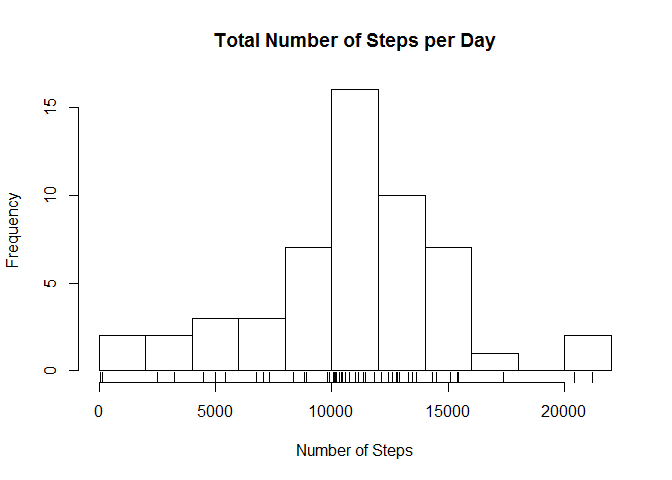
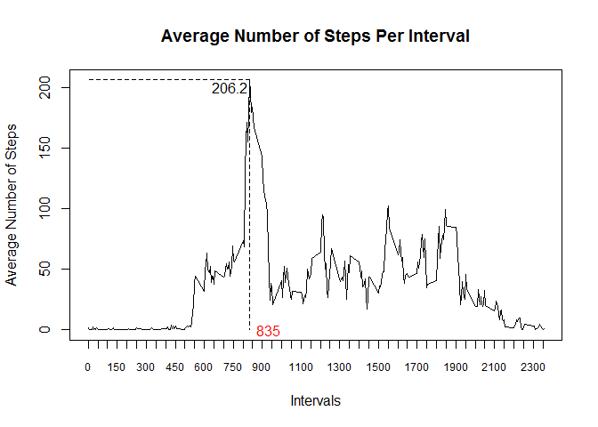
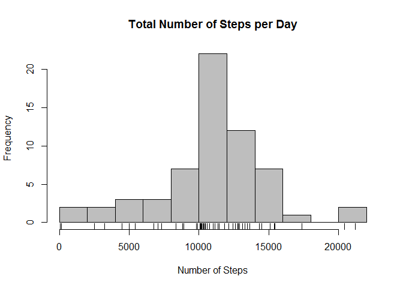
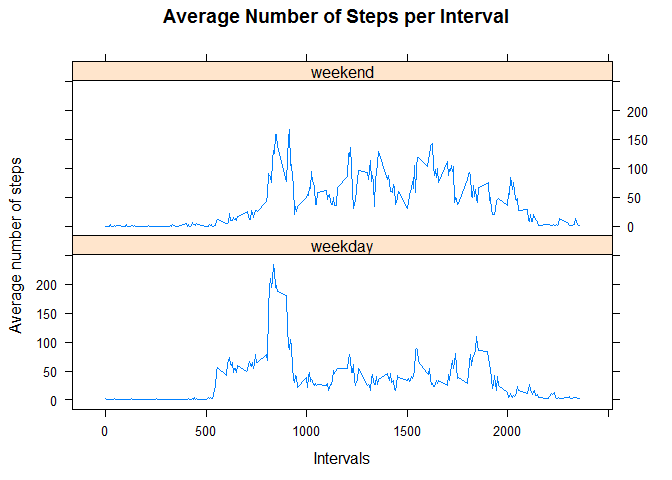

# Reproducible Research: Peer Assessment 1


### Loading and preprocessing the data


```r
amd <- read.csv("activity.csv", sep = ",", header = T)
str(amd)
```

```
## 'data.frame':	17568 obs. of  3 variables:
##  $ steps   : int  NA NA NA NA NA NA NA NA NA NA ...
##  $ date    : Factor w/ 61 levels "2012-10-01","2012-10-02",..: 1 1 1 1 1 1 1 1 1 1 ...
##  $ interval: int  0 5 10 15 20 25 30 35 40 45 ...
```
Based on the str() results, data in the field 'date' is stored as a factor and needs to be transformed into the Date format. We can use lubridate package to do the job:


```r
suppressMessages(library(lubridate))
```

```
## Warning: package 'lubridate' was built under R version 3.3.3
```

```r
amd$date <- ymd(as.character(amd$date))
str(amd$date)
```

```
##  Date[1:17568], format: "2012-10-01" "2012-10-01" "2012-10-01" "2012-10-01" ...
```


### What is mean total number of steps taken per day?

- Calculate the total number of steps taken per day

```r
total.steps <- aggregate(steps~date, data=amd, sum )
```

- Make a histogram of the total number of steps taken each day

```r
hist(total.steps$steps, breaks = 10, main = "Total Number of Steps per Day", xlab = "Number of Steps")
rug(total.steps$steps)
```

<!-- -->

- Calculate and report the mean and median of the total number of steps taken per day

```r
ms<- mean(total.steps$steps)
md<-median(total.steps$steps, na.rm = T)
```
-The average number of steps per day is 10766.19.

-The median number of  steps per day is 10765.  

### What is the average daily activity pattern?

- Make a time series plot (i.e.type = "l") of the 5-minute interval (x-axis) and the average number of steps taken, averaged across all days (y-axis)


```r
mean.int.steps <- aggregate(steps~interval, data=amd, mean)
plot(mean.int.steps$interval, mean.int.steps$steps, type = "l", xlab = "Intervals", 
     ylab = "Average Number of Steps", main= "Average Number of Steps Per Interval",xaxt="n")
axis(side=1, at=seq(from = 0, to = max(mean.int.steps$interval), by = 50), cex.axis=.75)

mline<-mean.int.steps$interval[which(mean.int.steps$steps== max(mean.int.steps$steps))]
segments(x0=mline, y0=max(mean.int.steps$steps), x1=0, y1=max(mean.int.steps$steps), lty=2)
segments(x0=mline, y0=max(mean.int.steps$steps), x1=mline, y1=0, lty=2)
text(x=mline-100, y=200, round(max(mean.int.steps$steps),1), cex=1); text(x=mline+100, y=0, mline, cex=1, col="red")
```

<!-- -->

```r
int<-format(mline)
mm<-format(max(mean.int.steps$steps))
```

- Which 5-minute interval, on average across all the days in the dataset, contains the maximum number of steps?

The 835th 5-minute interval contains on average the maximum number of steps (i.e., 206.1698). 


### Imputing missing values

- Calculate and report the total number of missing values in the dataset (i.e. the total number of rows with NAs)

```r
mis.steps<-sum(is.na(amd$steps))
```
The total number of missing values in the dataset is 2304.

- Devise a strategy for filling in all of the missing values in the dataset.

We are going to use a decision tree to predict missing values (rpart package). Our dependent variable is steps and independent variables are interval and date.

- Create a new dataset that is equal to the original dataset but with the missing data filled in.

```r
library(rpart)
fit <- rpart(steps~ interval+date, data = amd, method="anova")

amd$pred<-amd$steps
suppressWarnings(amd$pred[is.na(amd$steps)]<-predict(fit, data=amd[is.na(amd$steps)]))
```
- Make a histogram of the total number of steps taken each day

```r
new.mean.tot <-aggregate(pred~date, data=amd, sum)
hist(new.mean.tot$pred, xlab = "Number of Steps", ylab = "Frequency", main = "Total Number of Steps per Day",
     breaks = 10, col ="grey")
rug(new.mean.tot$pred)
```

<!-- -->

- Calculate and report the mean and median total number of steps taken per day. Do these values differ from the estimates from the first part of the assignment? What is the impact of imputing missing data on the estimates of the total daily number of steps?


```r
nms<- mean(new.mean.tot$pred)
nmds <-median(new.mean.tot$pred)
ch.mean<-nms-ms
ch.med<-nmds-md
```

-Using a complete dataset, the average number of steps per day is 10797.08. The change in mean is 30.88815, i.e., mean increased.

-The median number of steps per day is now 10571. The change in median is -194, i.e., median declined.


### Are there differences in activity patterns between weekdays and weekends?

- Create a new factor variable in the dataset with two levels - "weekday" and "weekend" indicating whether a given date is a weekday or weekend day.


```r
amd$weekdays<-weekdays(amd$date)
amd$weekday<-"weekday"
amd$weekday[amd$weekdays=="Saturday"|amd$weekdays=="Sunday"] <- "weekend"
```

- Make a panel plot containing a time series plot (i.e.type = "l") of the 5-minute interval (x-axis) and the average number of steps taken, averaged across all weekday days or weekend days (y-axis). 


```r
new.data <-aggregate(pred~interval+weekday, data=amd, mean)

library(lattice)

xyplot(pred  ~ interval | weekday, data = new.data, layout=c(1,2), 
       type="l", xlab="Intervals", ylab = "Average number of steps", main="Average Number of Steps per Interval")
```

<!-- -->
